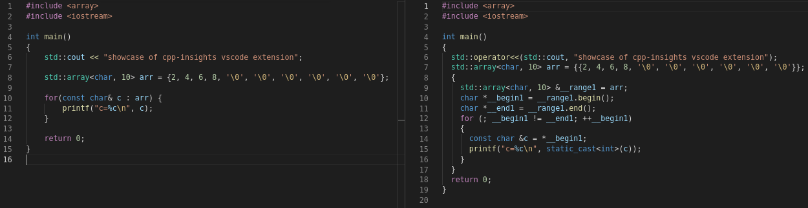
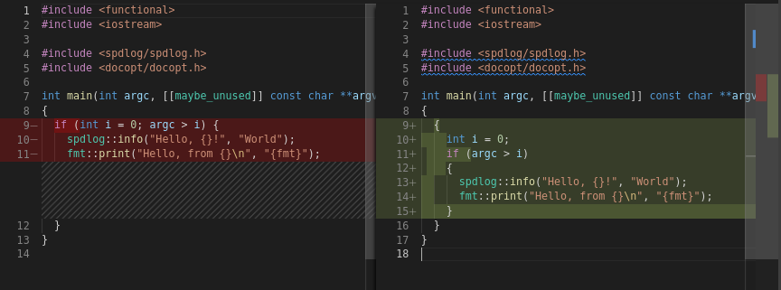

# C++ Insights for Visual Studio Code (VSCode)

<!-- ## Introduction -->

<!-- ## Features

For example if there is an image subfolder under your extension project workspace:

\!\[feature X\]\(images/feature-x.png\)

> Tip: Many popular extensions utilize animations. This is an excellent way to show off your extension! We recommend short, focused animations that are easy to follow. -->

## Features
This extension allows you to view C++ Insights inside of vscode:

  

or diff the Insights with your original source:

  

The extension can utilize a compilation database/compile commands for easy use in existing environments. You can specify a directory containing the compilation database, aka the  build directory, with `vscode-cppinsights.buildDirectory`.
If the active file is part of a workspace, and `vscode-cppinsights.buildDirectoryPrioritizeCMake` is set, the `cmake.buildDirecotry` is used to determine the build direcotry.

## Requirements
This extension requires @andreasfertig's C++ Insights.
C++ Insights can be found here:
https://github.com/andreasfertig/cppinsights.
Build or download the latest release and specify the path to the cppinsights binary in `vscode-cppinsights.path`.

## Commands
* `vscode-cppinsights.insights`: Show C++ insights
* `vscode-cppinsights.insightsDiff`: Show C++ insights diff with original

## Extension Settings
This extension contributes the following settings:
(You can find descriptions in the settings UI)
* `vscode-cppinsights.path`
* `vscode-cppinsights.buildDirectory`
* `vscode-cppinsights.buildDirectoryPrioritizeCMake`
* `vscode-cppinsights.args`
* `vscode-cppinsights.format`
* `vscode-cppinsights.experimental`

## Contribute
If you want to contribute, have an idea for a feature, or want to report an issue, please visit the [GitHub repository](https://github.com/devtbi/vscode-cppinsights).

## Known Issues
### Formatting (`vscode-cppinsights.format`)
* Enabling the option disables the "preview" property of the output editor
* When using the `insightsDiff` command, the output is not formatted like the original source

<!-- -----------------------------------------------------------------------------------------------------------
## Following extension guidelines

Ensure that you've read through the extensions guidelines and follow the best practices for creating your extension.

* [Extension Guidelines](https://code.visualstudio.com/api/references/extension-guidelines)

## Working with Markdown

**Note:** You can author your README using Visual Studio Code.  Here are some useful editor keyboard shortcuts:

* Split the editor (`Cmd+\` on macOS or `Ctrl+\` on Windows and Linux)
* Toggle preview (`Shift+CMD+V` on macOS or `Shift+Ctrl+V` on Windows and Linux)
* Press `Ctrl+Space` (Windows, Linux) or `Cmd+Space` (macOS) to see a list of Markdown snippets

### For more information

* [Visual Studio Code's Markdown Support](http://code.visualstudio.com/docs/languages/markdown)
* [Markdown Syntax Reference](https://help.github.com/articles/markdown-basics/)

**Enjoy!** -->
